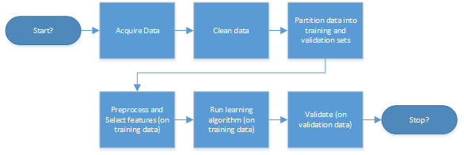

Caret: Classification and Regression Training
========================================================
author: John D. Johnson, Ph.D.
date: Jan 13, 2016
autosize: TRUE

Bio
========================================================

- Former life: math and science teacher
- Earned Ph.D. in statistics from UNC-CH in 2002
- Working as a biostatistician in pharmceutical research industry for last 13 years
- Extensive work with SAS and R in healthcare statistics, specializing in weird problems
- Casual "kaggler" (competitor at Kaggle.com)
- Consultant

Machine Learning
========================================================

- What does the computer scientist say?
- What does the statistician say?

I.e. predictive modeling vs. teaching a machine how to predict

The ML Pipeline
========================================================

Not displayed: all the lines pointing to previous steps and loops.

What is caret and how does it help?
========================================================

- Used through all computing phases of the ML pipeline
- Most obvious feature is a common interface to all the most common machine learning routines in R (base and popular packages) ...
- ... but it is much, much more

So, what else does caret do?
========================================================

- Helps create training and hold-out sets from a data set of training data (createDataPartition)
- Helps with preprocessing data (centering/scaling, principal components, transformations, imputation, etc.)
- Helps with feature selection (e.g. featurePlot)

***

- Provides the common interface to ML packages, along with automatically tuning regularization parameters using cross-validation or bootstrap
- Creates predictions on new or validation data, doing the right thing with preprocessing
- Creates confusion matrices along with summary statistics to assess out of sample error

In short ...
========================================================

Caret removes a lot of the drudgery out of machine learning, so you can focus more on the problem rather than the bookkeeping.

Demo
========================================================

Human activity recognition data from 
http://groupware.les.inf.puc-rio.br/har#collaborators#ixzz3IgG0oJx1
